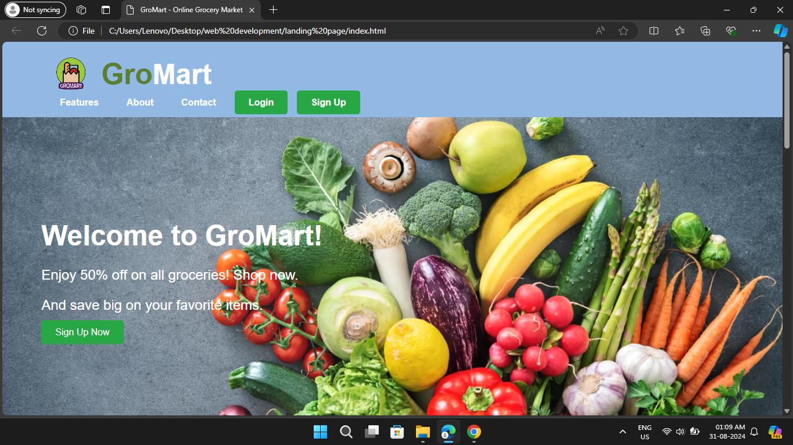

# GroMart Landing Page

Welcome to the GroMart Landing Page project! This project is a simple yet visually appealing landing page for GroMart, an online grocery market offering 50% off on groceries. The page is designed using HTML and CSS, featuring a clean and modern layout with a focus on usability and aesthetics.

## Table of Contents

- [Features](#features)
- [Technologies Used](#technologies-used)
- [Installation](#installation)
- [Usage](#usage)
- [Screenshots](#screenshots)
- [Project Structure](#project-structure)
- [Contributing](#contributing)
- [License](#license)
- [Contact](#contact)

## Features

- **Responsive Design**: The landing page is fully responsive, ensuring a great user experience on both desktop and mobile devices.
- **Modern UI/UX**: The design incorporates modern web design principles, including clear typography, ample white space, and a balanced color palette.
- **Navigation Bar**: Includes a navigation bar with links to the features, about, and contact sections.
- **Promotional Section**: Highlights the 50% off promotion on groceries with a call-to-action button.
- **Sign-Up and Login**: Provides easy access to sign-up and login forms, aligned on the right side of the navigation bar.
- **Customizable**: The project is easy to customize and extend with additional features.

## Technologies Used

- **HTML5**: For structuring the content.
- **CSS3**: For styling and layout.

## Installation

1. **Clone the Repository**:
    ```bash
    git clone https://github.com/krish8924/GroMart_landing_page.git
    ```
2. **Navigate to the Project Directory**:
    ```bash
    cd GroMart_landing_page
    ```

3. **Open the `index.html` file in your browser**:
    You can simply double-click the `index.html` file to open it in your default web browser.

## Usage

- **Customizing the Page**: You can modify the content, styles, and structure by editing the `index.html` and `styles.css` files.
- **Adding the Logo**: Replace the `logo.png` file in the project directory with your own logo to personalize the page.

## Screenshots




